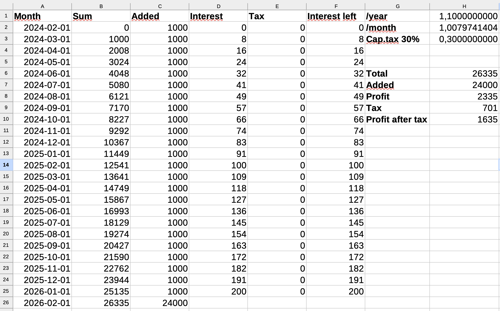

# CharZam Calculate Interest

In your home budget you might want to know how much you will get in interest each month.
You can not just divide the yearly interest with 12 and add that each month because then you get interest on the interest.
This tool will calculate the monthly interest for you. It handles the interest on the interest.

## Usage

Let's say you have 3.5 % yearly interest, and you save 1000 SEK each month.
You can enter the yearly percent into the tool and get the monthly interest percent.
With 3.5 % yearly interest, you get a decimal number of 1.0028708987190766 as monthly interest.

You might set up a sheet with the following columns:

* Month
* Total amount
* Amount added
* Amount in interest
* Tax on the interest. In Sweden you can calculate 30% tax on the interest.
* Interest after tax

After two years you will have 24563 SEK in your account.
Your profit after tax is 563 SEK after two years with the bank interest.

An alternative that usually gives more money is index funds with low management fees.
Low fees is important because they are deducted from your money each year. A low fee is 0.4 % or lower.
You only pay tax on the money you take out of the fund, not on the interest each year.
The interest is added to the fund, and you pay tax on the interest when you take out money.

Here is an example of how you can set up a sheet for index funds:

After two years you will have 26335 SEK in your account.
You get all money 26335 SEK, but you need to pay tax on the profit 701 SEK.
That gives you a profit after tax: 1635 SEK.
The index fund serves you double by having better interest and no tax until the day you take out the money.

# License

This documentation is copyright (C) 2024 Peter Lembke.  
Permission is granted to copy, distribute and/or modify this document under the terms of the GNU Free Documentation
License, Version 1.3 or any later version published by the Free Software Foundation; with no Invariant Sections, no
Front-Cover Links, and no Back-Cover Links.  
You should have received a copy of the GNU Free Documentation License along with this documentation. If not,
see [https://www.gnu.org/licenses/](https://www.gnu.org/licenses/). SPDX-License-Identifier: GFDL-1.3-or-later

Since 2024-06-08 by Peter Lembke  
Updated 2024-06-08 by Peter Lembke  